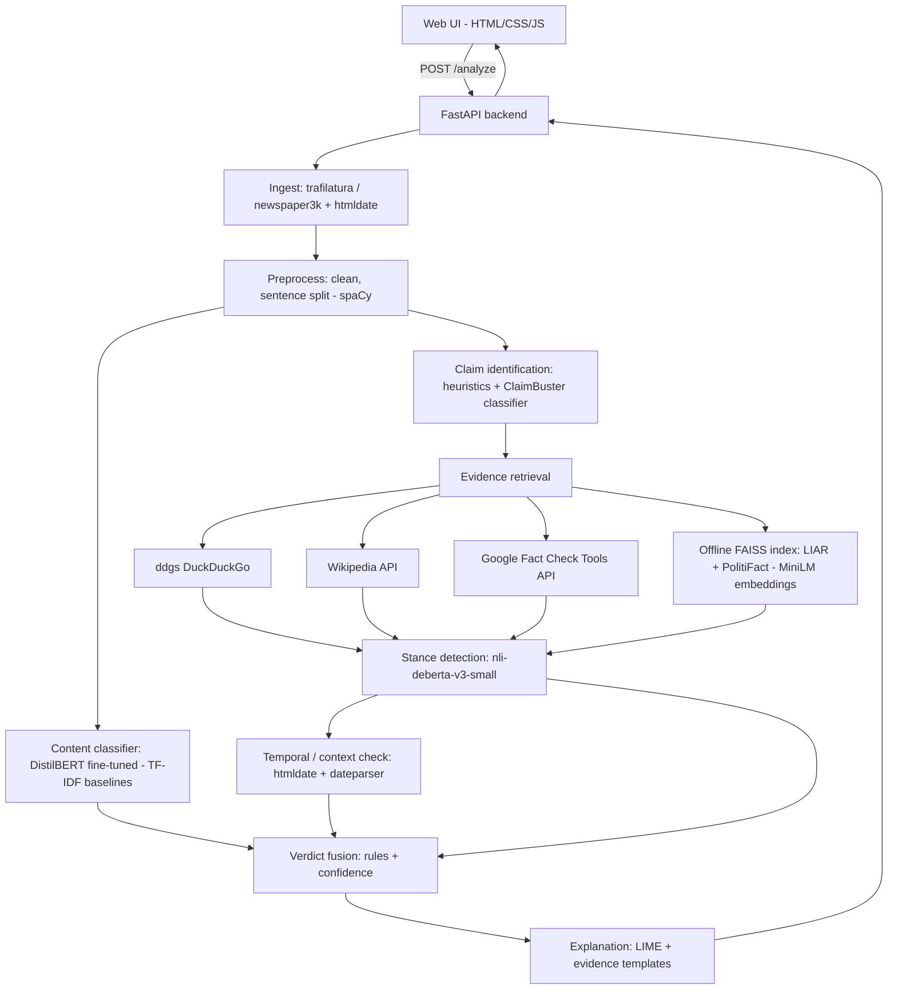

# 1. Title Block

| Field | Value |
|---|---|
| **Project title** | Fake News & Misinformation Detector: an evidence-grounded, explainable news verification system |
| **Department** | Department of CSE (AI/ML), KIET Group of Institutions, Ghaziabad |
| **Programme / course** | B.Tech — Semester Project (NLP / Machine Learning) |
| **Semester / year** | Odd semester, August–December 2026 |
| **Team members** | Navishka Sharma `<roll no.>`, Naitik Kukreja `<roll no.>`, Naveen `<roll no.>`, Prateek Srivastava `<roll no.>`, Nikhil `<roll no.>` |
| **Project guide** | `<Guide name, designation>` |
| **Document version** | v2.1 — 27 Aug 2026 (consistency pass against the MSE1/MSE2/ESE milestone docs: Makefile aliases, ESE window, DistilBERT grid, artefact names, non-English rule). v2.0 restructured; supersedes "Trimmed Semester-Project Scope" v1. |
| **Repository** | `/home/nikhil/Desktop/nlp` (local); GitHub remote `<to be added>` |

# 2. Executive Summary

**What it is.** A locally runnable web application that accepts a news **headline, full article, or URL**, extracts the important **claims**, retrieves **evidence** from reliable online sources (and an offline fact-check index when no internet is available), determines whether each piece of evidence **supports, refutes, or is neutral** toward the claim, checks **dates and context** (is old news being passed off as new?), and produces one of five verdicts — **REAL, FAKE, PARTIALLY TRUE, MISLEADING, UNVERIFIABLE** — with a confidence score, the evidence and sources (with dates) behind it, and a plain-language explanation.

**What it is NOT.** It is not a truth oracle, not a video/image forensics tool, not a multilingual platform, not a social-media crawler, and not a plain "fake/real" text classifier. When evidence is insufficient the system says **UNVERIFIABLE** rather than guessing. It never manufactures evidence, sources, quotes, or dates.

**Pipeline in one paragraph.** Input → content + publication-date extraction (`trafilatura`, `htmldate`) → text preprocessing → claim identification (spaCy sentence split + claim-worthiness scoring) → evidence retrieval (DuckDuckGo search, Wikipedia API, Google Fact Check Tools API, offline FAISS index of LIAR + PolitiFact statements) → stance detection per (claim, evidence) pair with an NLI cross-encoder → temporal/context check → rule-based verdict fusion (evidence decides the verdict; a fine-tuned DistilBERT content classifier only adjusts confidence and breaks ties) → explanation (LIME token highlights + evidence-linked template text + explicit uncertainty statement) → FastAPI backend → HTML/JS front-end, shipped as a Docker image and deployed on Hugging Face Spaces (free tier).

# 3. Problem Statement & Motivation

**Problem statement.** Given a news item (headline, article text or URL), automatically determine — with evidence, dates and a human-readable explanation — whether its central claims are real, fake, partially true, misleading, or unverifiable, using only free tools and hardware available to students.

**Why it matters — evidence from the real world**

1. False news spreads faster and farther than true news: in a study of ~126,000 story cascades on Twitter, falsehoods were 70% more likely to be retweeted and reached 1,500 people about six times faster than the truth (Vosoughi, Roy & Aral, *Science*, 2018).
2. The World Economic Forum's *Global Risks Report 2024* ranked **misinformation and disinformation as the #1 global risk over the next two years**, ahead of extreme weather and conflict.
3. Health misinformation has a body count: a 2020 study of the COVID-19 "infodemic" documented **at least 800 deaths and ~5,800 hospitalisations** linked to a single rumour (that drinking concentrated alcohol/methanol cures the virus) in the first three months of 2020 (Islam et al., *Am. J. Trop. Med. Hyg.*, 2020).
4. In India, WhatsApp-forwarded child-kidnapping rumours were linked to a wave of mob lynchings in 2018: BBC News (18 Jul 2018) counted **at least 17 people killed across India between April and July 2018**, Al Jazeera (17 Jul 2018) reported "more than two dozen", and IndiaSpend's tracker counted 33 deaths in 69 child-lifting-rumour attacks between Jan 2017 and Jul 2018 (verified 28 Aug 2026; the paper quotes the conservative BBC figure — see `docs/problem_identification.md`). Indian fact-checkers (AltNews, BOOM, Factly, PIB Fact Check) repeatedly debunk **old flood/riot/accident footage re-circulated as "breaking" news** during new events — exactly the "old news as new" pattern this project targets.

**Gap in existing tools.** Manual fact-checkers are accurate but slow and cannot cover every viral item. Most academic "fake news detectors" are binary text classifiers that learn *writing style* (and dataset artefacts) rather than checking *facts*, so they cannot say *why* an item is false, cannot handle partially true or out-of-context items, and cannot admit "I don't know". This project closes that gap at college-project scale.

# 4. Objectives

| # | Objective | Measurable target |
|---|---|---|
| O1 | Build a content classifier for fake vs. real news articles. | Macro-F1 ≥ 0.95 on WELFake held-out test; report cross-dataset F1 (WELFake→ISOT) honestly. |
| O2 | Identify check-worthy claims in an article. | Top-3 claims judged relevant by annotators in ≥ 80% of 50 sampled articles. |
| O3 | Retrieve evidence from free sources with an offline fallback. | ≥ 1 evidence passage for ≥ 85% of Live Claims Set items online; offline index answers in < 2 s. |
| O4 | Detect stance of evidence toward a claim. | Accuracy ≥ 85% (3-way) on a FEVER dev subset with gold evidence. |
| O5 | Detect "old news presented as new". | Correct flag on ≥ 80% of a 30-item hand-built temporal test set. |
| O6 | Produce a 5-class verdict with confidence and explanation. | Macro-F1 ≥ 0.55 on the ~100-item Live Claims Set (5 classes); UNVERIFIABLE precision ≥ 0.7. |
| O7 | Deliver a usable web app, containerised and deployed on a free tier. | Docker image builds; public HF Space URL responds; median latency ≤ 15 s online, ≤ 5 s offline. |
| O8 | Write and communicate an IEEE-format research paper. | Turnitin similarity < 10%; submission receipt from a conference/arXiv before ESE. |

# 5. Scope

## 5.1 In scope

- Inputs: English headline, English article text, or a public news URL.
- Content extraction, publication-date extraction, preprocessing.
- Claim identification and ranking.
- Evidence retrieval (online: DuckDuckGo, Wikipedia, Google Fact Check Tools; offline: local FAISS fact-check index).
- Stance detection (NLI) per claim–evidence pair.
- Temporal check (article date vs. evidence/event dates) and obvious out-of-context detection (entity/date mismatch).
- Rule-based fusion into REAL / FAKE / PARTIALLY TRUE / MISLEADING / UNVERIFIABLE + confidence.
- Explainable output: highlighted claims, LIME token importance, evidence list with sources and dates, plain-language explanation, explicit uncertainty statement.
- Web UI + REST API, Docker image, free-tier deployment, evaluation report, IEEE paper.

## 5.2 Out of scope (carried over and refined from v1)

| Removed feature | Reason |
|---|---|
| Video manipulation / deepfake detection | Separate, compute-heavy research problem. |
| Image forensics (edited/manipulated images) | Separate advanced problem; only OCR-free text input is supported. Screenshot OCR is a *stretch goal* only. |
| Large-scale multilingual support | English only. Hindi/Hinglish is a stretch goal via translation, not core. |
| Platform-specific crawlers (Instagram, TV, Twitter/X, WhatsApp) | Users paste text/URL; no scraping of walled platforms (ToS, keys, brittleness). |
| Full story-history reconstruction | Only the dates that matter for the "old vs. new" decision are checked. |
| Automatic reverse-search of the original source of every image/video | Future enhancement. |
| Absolute guarantees of truth | The system gives evidence-based conclusions with stated uncertainty. |
| Paid APIs / cloud GPUs / large LLMs (GPT-class) | Must run on a student laptop with free services. A local small LLM (Ollama) may *paraphrase* explanations as a stretch goal but is never on the critical path. |
| User accounts, history, moderation dashboards | Not needed for the evaluation criteria. |

# 6. Target Users & User Stories

**Primary users:** general news consumers (students, family members) who receive news via Instagram, WhatsApp, websites and TV and want a quick, understandable second opinion. **Secondary users:** examiners/viva panel, and the team itself (as a research testbed).

| ID | As a… | I want to… | So that… | Acceptance criterion |
|---|---|---|---|---|
| US-1 | News reader | paste a headline and get a verdict with reasons | I can decide whether to share it | Verdict + ≥ 1 evidence item or an explicit "no evidence found" within 15 s |
| US-2 | News reader | paste a URL | I don't have to copy the article | Article title, text and date are extracted and shown |
| US-3 | News reader | see *which sentences* drove the verdict | I can judge the reasoning myself | Claims are highlighted; each has its own stance summary |
| US-4 | News reader | be told when a "breaking" story is actually old | I don't panic over recycled news | Temporal warning with both dates shown |
| US-5 | Sceptical reader | see sources and dates for every piece of evidence | I can verify it myself | Every evidence card has source name, URL, date, and stance |
| US-6 | Examiner | run the system with no internet | the demo cannot fail on college Wi-Fi | `MODE=offline` returns verdicts from the local index |
| US-7 | Examiner | reproduce the reported numbers | I can trust the results | `make eval` regenerates every table/figure in the report |

# 7. Requirements

## 7.1 Functional requirements

| ID | Requirement |
|---|---|
| FR-1 | Accept input as headline text, article text, or URL via UI and `POST /analyze`. |
| FR-2 | For URLs, extract main article text, title and publication date; fail gracefully with an error message if extraction fails. |
| FR-3 | Preprocess text (normalisation, sentence segmentation, de-boilerplating) without altering claim meaning. |
| FR-4 | Identify and rank check-worthy claims; expose the top-k (k = 5 default) with scores. |
| FR-5 | Retrieve evidence passages for each top claim from online sources; fall back to (or combine with) the offline index. |
| FR-6 | Label each (claim, evidence) pair as SUPPORTS / REFUTES / NEUTRAL with a probability. |
| FR-7 | Extract publication and mentioned dates from input and evidence; flag "old news presented as new" and obvious entity/date mismatches. |
| FR-8 | Fuse signals into exactly one of the five verdicts with a 0–1 confidence using the documented rules. |
| FR-9 | Return an explanation containing: verdict reason, key claims, per-claim evidence (source, date, stance, snippet, URL), token-level highlights for the content classifier, and an uncertainty statement. |
| FR-10 | Provide a classifier-only endpoint (`POST /classify`) for evaluation and ablation. |
| FR-11 | Provide `GET /health` and `GET /config` (mode, model versions, source list). |
| FR-12 | Log every request (input hash, verdict, latency) locally for the evaluation report. |
| FR-13 | Detect the input language with a simple check (e.g. `langdetect`); non-English input returns **UNVERIFIABLE** with the message "English-only in this version" and no evidence search is attempted. |

## 7.2 Non-functional requirements

| ID | Requirement | Target |
|---|---|---|
| NFR-1 | **Latency** | Median ≤ 15 s per online request (search-bound), ≤ 5 s offline on CPU; classifier-only ≤ 1 s. |
| NFR-2 | **Offline fallback** | Full pipeline produces a verdict with `MODE=offline` using only local models and the FAISS index. |
| NFR-3 | **No fabricated evidence** | Every evidence item shown must be traceable to a retrieved document/URL or an offline index record ID. No generative model may produce evidence text. |
| NFR-4 | **Explainability** | Every verdict includes the rule that fired, the evidence used, and the confidence breakdown. |
| NFR-5 | **Reproducibility** | Fixed random seeds; `requirements.txt` pinned; `make data`, `make train`, `make eval` regenerate all artefacts; dataset versions/URLs recorded. |
| NFR-6 | **Hardware** | Training fits an RTX 2050/3050-class 4 GB laptop GPU (fp16) or a CPU-only laptop via the subset path; inference runs on CPU with ≤ 4 GB RAM. |
| NFR-7 | **Cost** | Zero paid services. API keys only for free tiers (Google Fact Check Tools). |
| NFR-8 | **Robustness** | Any external source failing (timeout, rate limit) degrades to the remaining sources, never to a crash. |
| NFR-9 | **Privacy** | No user input leaves the machine except search queries derived from claims; nothing is stored beyond local logs. |
| NFR-10 | **Portability** | Runs from `docker compose up` on Linux/Windows/macOS; deployable to Hugging Face Spaces (Docker SDK). |

# 8. Output Classification Scheme

| Class | Precise definition | Example |
|---|---|---|
| **REAL** | The main claim(s) are supported by reliable evidence, with no temporal/context inconsistency. | "ISRO's Chandrayaan-3 landed near the lunar south pole on 23 Aug 2023." → supported by ISRO, Reuters, Wikipedia. |
| **FAKE** | Reliable evidence (especially fact-checkers) refutes the main claim, or the claim is shown to be fabricated. | "WHO declared that 5G towers spread COVID-19." → refuted by WHO and multiple fact-checkers. |
| **PARTIALLY TRUE** | Some important claims are supported while other important claims are refuted, or a true core is accompanied by materially wrong details (numbers, names, dates). | "India's population overtook China's in 2023, reaching 2 billion." → first part supported, the figure is wrong (~1.43 bn). |
| **MISLEADING** | Claims are individually supportable but presented in a wrong context: old events presented as current, a real quote/statistic attached to the wrong event/place, or a headline that the article body contradicts. | A 2018 Kerala-flood video shared in 2026 with "BREAKING: Kerala under water today". |
| **UNVERIFIABLE** | No reliable evidence found, or evidence is neutral/contradictory with low weight; the system cannot reach a trustworthy conclusion. | "A local shop in Ghaziabad sold 500 phones in one hour." → no coverage in any indexed source. |

UNVERIFIABLE is a first-class, *expected* output — for hyper-local, very recent, or opinion-like inputs it is the correct answer.

# 9. System Architecture

## 9.1 Component diagram (Mermaid)



## 9.2 Text diagram

```
+-----------+   +----------+   +------------+   +-----------------+
| Web UI    |-->| FastAPI  |-->| Ingest     |-->| Preprocess      |
| (HTML/JS) |<--| /analyze |   | text/URL + |   | clean + spaCy   |
+-----------+   +----------+   | pub date   |   | sentences       |
                                +------------+   +--------+--------+
                                                          |
                     +------------------------------------+-------------------+
                     |                                                        |
            +--------v--------+                                    +----------v---------+
            | Claim identifier|                                    | Content classifier |
            | (heuristics +   |                                    | DistilBERT (+LIME) |
            |  ClaimBuster)   |                                    +----------+---------+
            +--------+--------+                                               |
                     | top-k claims                                           |
            +--------v--------------------------------------+                 |
            | Evidence retrieval                            |                 |
            | online: ddgs | Wikipedia | Google Fact Check  |                 |
            | offline: FAISS (LIAR + PolitiFact, MiniLM)    |                 |
            +--------+--------------------------------------+                 |
                     | (claim, evidence, source, date) tuples                 |
            +--------v--------+      +--------------------+                   |
            | Stance (NLI)    |----->| Temporal / context |                   |
            | deberta-v3-small|      | check              |                   |
            +--------+--------+      +---------+----------+                   |
                     |                         |                              |
            +--------v-------------------------v------------------------------v---+
            | Verdict fusion (rules) -> 5-class label + confidence                |
            +--------------------------------+------------------------------------+
                                             |
            +--------------------------------v------------------------------------+
            | Explanation: rule fired, claims, evidence cards, LIME highlights,    |
            | uncertainty statement  -> JSON -> UI                                |
            +---------------------------------------------------------------------+
```

## 9.3 Component table

Owners follow the proposed role split in §23 (adjust as agreed by the team).

| Module (`src/…`) | Responsibility | Tech | Owner (proposed) |
|---|---|---|---|
| `ingest` | URL → title, text, publication date; text passthrough | `trafilatura`, `newspaper3k` fallback, `htmldate`, `requests` | Prateek Srivastava (Backend/API/Deployment) |
| `preprocess` | Cleaning, boilerplate removal, sentence split, artefact removal for training data | `spaCy en_core_web_sm`, regex, `pandas` | Navishka Sharma (Data & EDA) |
| `models` | TF-IDF baselines, Bi-LSTM (optional), DistilBERT fine-tune, LIAR fine-grained head | `scikit-learn`, `PyTorch`, `transformers`, `datasets` | Naitik Kukreja (Modelling) |
| `claims` | Claim-worthiness scoring and ranking | spaCy NER/POS heuristics, optional LR on ClaimBuster | Naveen (Claim/Evidence/Stance) |
| `evidence` | Query building, online search, Wikipedia, Google Fact Check, offline FAISS index, source reliability | `ddgs`, `wikipedia-api`/REST, Google Fact Check Tools API, `sentence-transformers`, `faiss-cpu` | Naveen (Claim/Evidence/Stance) |
| `stance` | NLI stance per (claim, evidence) | `cross-encoder/nli-deberta-v3-small` | Naveen (Claim/Evidence/Stance) |
| `temporal` | Date extraction and old-news/out-of-context flags | `htmldate`, `dateparser`, spaCy DATE/GPE entities | Navishka Sharma (Data & EDA) |
| `fusion` | Decision rules and confidence | pure Python, YAML config | Prateek Srivastava (Backend/API/Deployment) with Naveen |
| `explain` | LIME highlights, template explanations, uncertainty text | `lime`, `shap` (optional), Jinja2 templates | Nikhil (UI/XAI/Paper) |
| `api` | REST endpoints, request logging | `FastAPI`, `uvicorn`, `pydantic` | Prateek Srivastava (Backend/API/Deployment) |
| `app/` | Front-end | HTML/CSS/vanilla JS (Streamlit fallback) | Nikhil (UI/XAI/Paper) |
| `docker/` | Dockerfile, compose, HF Space config | Docker | Prateek Srivastava (Backend/API/Deployment) |

# 10. Datasets

| # | Dataset | Size | Labels | Source | License / access | Role |
|---|---|---|---|---|---|---|
| D1 | **WELFake** (Verma et al., 2021) | 72,134 articles (35,028 real / 37,106 fake); title + text | CSV column `label`: **0 = real, 1 = fake** (the Zenodo/Kaggle blurb says the opposite, but the file's 35,028 label-0 rows are the Reuters-style real articles — verified 2026-08-28, see `data/README.md`) | Zenodo record 4561253 (`WELFake_Dataset.csv`, fetched by `make download` via the Zenodo API — **no Kaggle login needed**); Kaggle mirror `saurabhshahane/fake-news-classification` | Free download; **CC BY 4.0** on Zenodo (verified 28 Aug 2026 via the Zenodo API record, `license.id = cc-by-4.0`; the Kaggle mirror shows no separate licence) | **Primary** article-level train/val/test for the content classifier. **Contains ISOT:** WELFake = Kaggle + McIntire + Reuters/ISOT + BuzzFeed Political, and ≈ 99.6 % of the processed ISOT articles occur verbatim in processed WELFake (MSE1 finding, `docs/eda_summary.md`, `docs/model_identification.md` §4.2) |
| D2 | **ISOT Fake News** (Ahmed, Traore & Saad, 2017) | 44,898 articles (21,417 true from Reuters / 23,481 fake) | True / Fake | University of Victoria ISOT lab page (direct zip `News-_dataset.zip`, fetched by `make download`); Kaggle mirror `clmentbisaillon/fake-and-real-news-dataset` as manual fallback | Free for research (cite Ahmed et al.) | Secondary; artefact/leakage study (raw vs. processed); **cross-dataset generalisation** only against the hash-join-defined **WELFake∖ISOT** subset (≈ 23.3k rows) — plain "train WELFake → test ISOT" is in-domain because ISOT ⊂ WELFake |
| D3 | **LIAR** (Wang, 2017) | 12,836 short PolitiFact statements; train 10,269 / val 1,284 / test 1,283; speaker metadata | pants-fire, false, barely-true, half-true, mostly-true, true | https://www.cs.ucsb.edu/~william/data/liar_dataset.zip; HF `liar` | Free for research | Fine-grained/partial-truth modelling; **offline fact-check index** |
| D4 | **FEVER** (Thorne et al., 2018) | 185,445 claims with Wikipedia evidence; we sample 20–30k | SUPPORTS / REFUTES / NOT ENOUGH INFO | https://fever.ai/dataset/fever.html; HF `fever` (`v1.0`) | CC BY-SA 3.0 | Evaluate (and optionally fine-tune) the **stance/NLI** model |
| D5 | **FakeNewsNet — PolitiFact subset** (Shu et al., 2018) | ~1,056 news items (432 fake / 624 real) with titles, PolitiFact labels | fake / real | GitHub `KaiDMML/FakeNewsNet` (CSV with titles/URLs) | Free; full content requires crawling (we use titles only) | Adds to the **offline fact-check index** |
| D6 | **ClaimBuster** (Arslan et al., 2020) | 23,533 debate sentences | CFS (check-worthy factual), UFS, NFS | Zenodo record 3609356 | **CC BY 4.0** (verified 28 Aug 2026 via the Zenodo record; 23,533 sentences confirmed) | Optional trainer for the **claim-worthiness** classifier |
| D7 | **Live Claims Set** (ours) | ~100 recent claims (Aug–Nov 2026) | 5-class (our scheme) | Hand-labelled from PolitiFact, Snopes, AltNews, BOOM | Created by team; released with the repo | **End-to-end evaluation** of the full pipeline |

**Loading note.** The Hugging Face Hub `liar` and `fever` datasets are *script-based* loaders, which `datasets>=3` no longer executes, so `load_dataset("liar")` / `load_dataset("fever", "v1.0")` may fail. Primary sources are therefore the direct UCSB LIAR zip (`liar_dataset.zip`, TSV) and the fever.ai JSONL files (`train.jsonl`, `shared_task_dev.jsonl`), downloaded into `data/raw/` and parsed with `pandas`; the HF Hub entries are convenience mirrors only.

## 10.1 Label mapping: LIAR (6) → project scheme (5)

| LIAR label | Project class | Rationale |
|---|---|---|
| true | REAL | Fully accurate. |
| mostly-true | REAL | Accurate with minor clarifications; PolitiFact treats it as essentially true. |
| half-true | PARTIALLY TRUE | Accurate but leaves out important details / mixed. |
| barely-true | MISLEADING | Contains an element of truth but ignores critical facts (PolitiFact's own definition). |
| false | FAKE | Not accurate. |
| pants-fire | FAKE | Not accurate and ridiculous. |
| *(none)* | UNVERIFIABLE | LIAR has no such label; it arises only from retrieval failure at run time. |

For training a fine-grained classifier we additionally use a **3-way collapse** (TRUE = true + mostly-true; MIXED = half-true + barely-true; FALSE = false + pants-fire), because 6-way LIAR accuracy is known to be low (~27% text-only in Wang, 2017) and the 3-way head is what fusion consumes.

## 10.2 Label mapping: FEVER → stance

| FEVER label | Stance label | NLI model output |
|---|---|---|
| SUPPORTS | SUPPORTS | entailment |
| REFUTES | REFUTES | contradiction |
| NOT ENOUGH INFO | NEUTRAL | neutral |

For NEI claims we pair the claim with a randomly retrieved Wikipedia sentence from the same page (standard practice) so the stance model sees realistic "irrelevant" evidence.

# 11. Data Preprocessing & EDA Plan

## 11.1 Preprocessing steps (all in `src/preprocess/`, run via `make data`)

1. **Load & unify** the schema: `id, title, text, label, label5, label3, source_dataset, date, split, meta` — identical for every dataset (`src/config.SCHEMA`); `label5`/`label3` are the §10.1 mappings (binary datasets get REAL/FAKE and TRUE/FALSE), `date` is filled only where the source has one (ISOT), `split` holds the official (LIAR, FEVER) or generated split, `meta` is a JSON string with dataset-specific extras (ISOT subject, LIAR speaker/party, FEVER evidence ids).
2. **Drop** rows with empty/NaN text or text < 20 tokens; log counts dropped.
3. **Exact and near-duplicate removal**: SHA-1 on normalised text for exact; MinHash/`datasketch` (or TF-IDF cosine > 0.9 on a sample) for near-duplicates; **check that no duplicate spans train/test** (holds for the WELFake/ISOT splits we generate; LIAR's *official* splits contain 5 train∩val and 4 train∩test identical statements — kept for comparability with the literature and disclosed).
4. **Artefact / leakage removal** (critical for honest numbers):
   - Strip the ISOT "`WASHINGTON (Reuters) - `" dateline prefix and any "`(Reuters)`" token; strip "`Featured image via …`", "`Read more:`", "`21st Century Wire says…`" trailers common in fake articles.
   - Remove URLs, e-mail addresses, Twitter handles, and "`@realDonaldTrump`"-style tokens that act as label shortcuts.
   - **Residual publisher/format artefacts found by the MSE1 LR coefficients and stripped since (2026-08-28):** bracketed title tags `[VIDEO]` / `(IMAGES)` / `[TWEETS]`, trailing outlet suffixes in titles (" - Breitbart", " - The New York Times", " - TruthFeed" …, closed list), photo/image credits ("Photo: … via Getty Images", "(Photo by AFP)", "Image credit: …", "Featured Image: …"), source lines "Via: <outlet>", embed captions ("Watch it below:", "Here's the video via YouTube"), bylines ("Follow <name> on Twitter", "<name> is a reporter for Breitbart …"), 21WIRE "SUPPORT / Continue this story at" stubs, and the debris WELFake's own tokenisation left behind (`pic. twitter.`, `https: .`, empty `( )`, embedded-tweet time-stamps). Bare source names inside prose ("told Reuters", "Breitbart News reported") are content and stay.
   - Report the accuracy of a classifier trained *only* on these artefacts to quantify the leakage (expected: very high on ISOT — this becomes a discussion point).
5. **Normalisation**: Unicode NFKC, lower-casing (for TF-IDF only — cased text kept for transformers), whitespace collapse, quote normalisation. The processed parquet keeps the raw cased text because spaCy NER and claim extraction need capitalisation; the chosen `distilbert-base-uncased` tokenizer lower-cases internally, so no separate lower-cased copy is stored (and a cased model can be swapped in later without re-running `make data`).
6. **Sentence segmentation** with spaCy for the claim module; keep sentence offsets for highlighting.
7. **Tokenisation**: sklearn `TfidfVectorizer` (word 1–2-grams + optional char 3–5-grams) for baselines; `DistilBertTokenizerFast` (max_len 256, head-truncation of title + text) for the transformer.
8. **Splits**: stratified **80/10/10** train/val/test per dataset with `random_state=42`; splits saved as CSVs of IDs so every model uses identical splits. LIAR keeps its official splits. FEVER subset: 20k train / 3k dev sampled with fixed seed, balanced across the three labels.
9. **Class balance**: WELFake and ISOT are near-balanced; LIAR is mildly imbalanced — use class weights, not resampling.

## 11.2 EDA outputs (notebook `notebooks/01_eda.ipynb`, figures saved to `docs/figures/`)

| Plot / table | Purpose |
|---|---|
| Class distribution bars per dataset | Show balance; justify metrics |
| Histogram of article/claim lengths (tokens) per class | Length distribution per class (measured: the *real* class has the wider spread — short wire briefs and long pieces; fakes cluster at 250–550 words); together with the DistilBERT-tokenizer coverage plot (only ≈ 19 % of WELFake inputs fit in 256 tokens, ≈ 50 % in 512; head truncation at 256 keeps a median 50 % of an article) it makes max_len = 256 an explicit GPU-budget choice and motivates sweeping 256 vs 512 |
| Top 30 unigrams/bigrams per class (after artefact removal) and **before** removal | Demonstrate leakage tokens (measured: "reuters", "washington" for real; "featured image", "image via", "getty images", "pic twitter", "twitter com", "screen capture", "21wire", "https" for fake — these vanish after removal; "hillary" and "said" remain because they are content/register, not source) |
| Word clouds per class | Presentation aid only |
| Named-entity type frequencies per class (spaCy) | Motivates claim heuristics |
| Publication-date distribution (ISOT has dates 2015–2018) | Motivates temporal check; shows dataset age |
| Duplicate/near-duplicate counts and cross-split overlaps | Leakage audit |
| LIAR 6-label and 3-label distributions; label vs. speaker party | Fine-grained difficulty discussion |
| FEVER subset label balance; evidence pointers per claim (the parquet stores page + sentence ids, not sentence text); claim length | Stance model input sizing |
| Readability / punctuation / ALL-CAPS ratio per class | Style features discussion |

# 12. Models

## 12.1 Model ladder and rationale

| Tier | Model | Why included | Expected role |
|---|---|---|---|
| Baseline | TF-IDF + Multinomial Naive Bayes | Fast, classic NLP baseline; viva-friendly | Reference point |
| Baseline | TF-IDF + Logistic Regression | Strong linear baseline; coefficients are interpretable | Reference + interpretable feature analysis |
| Baseline | TF-IDF + Linear SVM (`LinearSVC`) | Usually best classical model on this task | Best classical; CPU fallback for deployment |
| Middle (optional) | Bi-LSTM + GloVe 100d | Shows sequence modelling; cheap on the 4 GB GPU | Only if time permits (week 9) |
| Final | **DistilBERT-base-uncased fine-tuned** | Best accuracy/size trade-off; 66M params; fits 4 GB GPU with fp16 | Content classifier in production |
| Fine-grained | DistilBERT (or TF-IDF+LR) on LIAR 3-way | Gives a truth-shade probability for short claims | Confidence adjustment in fusion |
| Stance | `cross-encoder/nli-deberta-v3-small` (pre-trained on SNLI/MNLI/FEVER-NLI etc.) | Ready-made NLI cross-encoder, ~140M params, CPU-usable | Stance detection; optional fine-tune on FEVER subset |
| Embedding | `all-MiniLM-L6-v2` (22M params) | Fast sentence embeddings for the offline index and passage re-ranking | Retrieval |
| Claims (optional) | TF-IDF + LR on ClaimBuster | Cheap check-worthiness classifier | Combined with heuristics |

**Why not a large LLM?** Cost, hardware, non-reproducibility, and hallucination risk directly conflict with NFR-3 (no fabricated evidence). A local small LLM via Ollama is permitted only to *rephrase* an already-generated template explanation (stretch).

## 12.2 Hyperparameter search spaces

| Model | Search method | Space | Selection metric |
|---|---|---|---|
| TF-IDF + NB / LR / SVM | `GridSearchCV` (5-fold, on train) | `ngram_range ∈ {(1,1),(1,2)}`, `max_features ∈ {50k, 100k, 200k}`, `sublinear_tf ∈ {T,F}`; LR/SVM `C ∈ {0.1, 1, 10}`; NB `alpha ∈ {0.1, 0.5, 1.0}` | Macro-F1 on validation |
| Bi-LSTM (optional) | Manual, 4 runs | hidden ∈ {128, 256}, dropout ∈ {0.3, 0.5}, lr 1e-3, 5 epochs, early stopping | Val macro-F1 |
| DistilBERT | **Reduced manual grid of ≤ 6 configurations** (Optuna over the same 6 points is optional, never more) | lr ∈ {2e-5, 3e-5, 5e-5} × max_len ∈ {256, 512} = 6 configs (the EDA showed that max_len 128 keeps only ~25 % of a typical article and 256 ~50 %, so 512 rather than 128 is the informative second point); fixed: epochs = 3 (the best epoch by val macro-F1 is kept, which subsumes the epochs ∈ {2, 3} choice), warmup ratio 0.1, weight decay 0.01, fp16; batch 16 at max_len 256, batch 8 × grad-accum 2 (effective 16) at max_len 512, gradient checkpointing as the second fallback — both fit the 4 GB card | Val macro-F1; every config runs on a 20k stratified subset (≈ 20 min at 256, ≈ 40 min at 512 → ≈ 3 h for all 6), then the best config is retrained on the full train split (≈ 1–1.25 h at 256, ≈ 2–2.5 h at 512); total DistilBERT budget ≈ 4–5.5 h GPU over two or three evenings |
| LIAR 3-way head | Same as DistilBERT with class weights | lr ∈ {2e-5, 3e-5}, epochs ∈ {3, 5} | Val macro-F1 |
| Stance fine-tune (optional) | 2 runs | lr ∈ {1e-5, 2e-5}, 1 epoch on 20k FEVER pairs, max_len 256 | Dev accuracy |
| Fusion thresholds | Grid on a 30-item dev slice of the Live Claims Set | support/refute margins, min evidence count, temporal gap N months | 5-class macro-F1; grid recorded in `docs/results/fusion_thresholds.md` |

## 12.3 Hardware and time budget

| Model | Hardware | Estimated time | Notes |
|---|---|---|---|
| TF-IDF + NB/LR/SVM on 48.7k WELFake train (after dedup) | CPU (4–8 cores) | ≈ 55 s TF-IDF fit + ≤ 5 s per classifier (measured 2026-08-28, peak RSS ≈ 2.6 GB); full GridSearch 30–60 min | Cache the TF-IDF matrix |
| Bi-LSTM + GloVe | RTX 2050/3050-class 4 GB | ~5–10 min/epoch | Skip if behind |
| DistilBERT, max_len 256, batch 16, fp16 (max_len 512: batch 8 × grad-accum 2, ≈ 2× the time) | RTX 2050/3050-class 4 GB (dev laptop: RTX 2050, 3.68 GiB usable) | ~15–25 min/epoch on 48.7k; 3 epochs ≈ 1–1.25 h; each sweep run on a 20k subset ≈ 20 min at 256 / ≈ 40 min at 512 (6 configs ≈ 3 h, §12.2) | Enable `fp16=True`, `gradient_checkpointing` if OOM |
| DistilBERT — CPU-only member | Laptop CPU | 10k subset, max_len 128, 2 epochs ≈ 1.5–3 h | Or use **Google Colab free T4** (free) and download the checkpoint |
| LIAR 3-way DistilBERT | RTX 2050/3050-class 4 GB | ~3 min/epoch (10k short texts) | |
| Stance fine-tune on 20k FEVER pairs | RTX 2050/3050-class 4 GB | ~30–40 min/epoch with batch 8 + grad-accum | Optional |
| MiniLM embeddings of ~14k index statements | CPU | ~2 min | One-off, cached |

All GPU checkpoints are saved to `data/models/` and shared with CPU-only members, who only need inference.

# 13. Core NLP Components

## 13.1 Claim identification

**Goal:** From an article of 20–60 sentences, pick the ≤ 5 sentences that are (a) factual assertions, (b) important to the story, (c) checkable.

Algorithm:

1. Sentence-split with spaCy; drop sentences < 6 tokens or that are questions/imperatives.
2. For each sentence compute heuristic score  
   `h = 1.0·[has NE of type PERSON/ORG/GPE/EVENT] + 0.8·[has CARDINAL/PERCENT/MONEY/DATE] + 0.6·[has reporting verb: said, announced, confirmed, claimed, reported, according to] + 0.5·[position: title or first 3 sentences] + 0.4·[contains numbers/comparatives] − 0.8·[first-person opinion cue: I think, we believe, should, must] − 0.5·[modal/hedge: may, might, could]`.
3. Optional learned score `p_cw` from a TF-IDF + LR classifier trained on ClaimBuster (CFS vs. rest).
4. Final `score = 0.5·h_norm + 0.5·p_cw` (or `h_norm` alone if the classifier is not trained).
5. De-duplicate near-identical sentences (cosine > 0.85 with MiniLM); return top-k with scores and character offsets. The headline (if present) is always claim #1.

```
def identify_claims(text, title=None, k=5):
    sents = spacy_split(text)
    cands = [s for s in sents if len(s) >= 6 and not is_question(s)]
    scored = [(s, 0.5*heur(s) + 0.5*claimbuster_prob(s)) for s in cands]
    if title: scored.insert(0, (title, 1.0))
    return dedupe_top_k(scored, k)
```

## 13.2 Evidence retrieval

1. **Query construction** per claim: keep named entities + numbers + head noun/verb lemmas (spaCy), drop stop-words; produce two queries — `q_full` (the claim, ≤ 15 words) and `q_keywords` (entities + key terms). Add `fact check` to a third query variant.
2. **Online sources** (each with a 6 s timeout, run concurrently with `asyncio`/threads):
   - `ddgs` text search (`max_results=8`) for `q_full` and `q_keywords + " fact check"`.
   - Wikipedia REST search (`/w/api.php?action=query&list=search`) → fetch the top-2 page intros.
   - Google Fact Check Tools `claims:search` with `q_keywords` (free API key, 10k requests/day).
3. **Offline index**: MiniLM embeddings of LIAR statements (with PolitiFact ruling), FakeNewsNet PolitiFact titles, and any cached online results; FAISS `IndexFlatIP`; return top-5 with cosine ≥ 0.55.
4. **Passage building**: for search hits fetch the page with `trafilatura` (cap 5 pages/claim), split into sentences, embed with MiniLM, keep the top-3 sentences per page by cosine to the claim (this is the "evidence passage"). Record `source_domain`, `url`, `published_date` (`htmldate`), `retrieved_at`.
5. **Source reliability weight** `w_s` from `src/evidence/sources.yaml` (§14.3). Drop items with `w_s = 0` (satire/known-hoax domains) but display them as a warning ("this claim originates from a satire site").
6. Return ≤ 10 evidence items per claim, sorted by `cosine × w_s`.

Caching: every online result is cached in `data/cache/evidence.sqlite` keyed by query hash, so demos and evaluation runs are repeatable and rate-limit-safe.

## 13.3 Stance detection

For each (claim, evidence passage) pair run `cross-encoder/nli-deberta-v3-small` with premise = evidence, hypothesis = claim. Map: entailment → SUPPORTS, contradiction → REFUTES, neutral → NEUTRAL, keep the softmax probability `p_stance`. For fact-check API hits, additionally map the fact-checker's textual rating (e.g., "False", "Pants on Fire", "Misleading", "True") to a stance with `p_stance = 0.95`, because a fact-checker's verdict is stronger than an NLI guess. Batch size 16 on CPU (~0.15 s/pair on a laptop CPU; ~50 pairs per request worst case).

```
for claim in claims:
    for ev in claim.evidence:
        probs = nli(premise=ev.passage, hypothesis=claim.text)
        ev.stance, ev.p = argmax_map(probs)
        ev.signed = (+1 if SUPPORTS, -1 if REFUTES, 0) * ev.p * ev.w_source
```

## 13.4 Temporal / context check

Inputs: `t_post` (publication date of the input; for pasted text, "today" unless a date is found in the text), evidence dates `t_ev` (publication date via `htmldate`, plus DATE entities inside the passage parsed by `dateparser`), recency cues in the input text.

1. Recency cue set `R = {breaking, just in, just now, moments ago, today, this morning, tonight, right now, happening now, live}` (case-insensitive; also "BREAKING" in title).
2. For the main claim, take `t_event = median(dates of SUPPORTING evidence)`.
3. **Old-news flag** if `has_recency_cue AND (t_post − t_event) ≥ N months` with `N = 6` (tunable in `fusion.yaml`).
4. **Out-of-context flag** if the claim's GPE/EVENT/DATE entities conflict with those in ≥ 2 supporting passages (e.g., claim says "Kerala 2026", evidence says "Kerala 2018"; claim says "Delhi", evidence says "Dhaka") using spaCy entity comparison with fuzzy matching.
5. **Headline–body mismatch flag** if the headline claim's stance against the body sentences (NLI with body as premise) is REFUTES with p ≥ 0.7.
6. Output: `{old_news: bool, gap_months, out_of_context: bool, mismatch_headline: bool, evidence_dates: [...]}` — all dates are surfaced in the UI.

# 14. Verdict Fusion Rules & Confidence

## 14.1 Signals

For the top-k claims (weights `c_i` = claim score, main claim = claim 1):

- `S_i = Σ_e ev.signed` (net signed evidence for claim i), `E_i` = number of non-neutral evidence items with `w_s ≥ 0.5`.
- `main_stance` = SUPPORTS if `S_1 ≥ +τ`, REFUTES if `S_1 ≤ −τ`, else NEUTRAL (`τ = 0.6` default).
- `p_fake` = DistilBERT fake probability; `p_liar` = 3-way LIAR head on the main claim (headline).
- Temporal flags from §13.4.

## 14.2 Decision table (evaluated top to bottom; first match wins)

**Language pre-check (before R0):** if the input is not English (simple language check, e.g. `langdetect` on the title + first 500 characters), the pipeline short-circuits to **UNVERIFIABLE** with the reason "English-only in this version" and skips retrieval, stance and the classifier (FR-13).

| Rule | Condition | Verdict |
|---|---|---|
| R0 | Source domain of the input is on the satire/known-hoax list | FAKE (reason: "originates from a satire/hoax site") |
| R1 | No evidence retrieved for any claim, **or** all evidence NEUTRAL, **or** `E_1 = 0` | **UNVERIFIABLE** |
| R2 | A Tier-1 fact-checker item with rating ∈ {False, Pants on Fire, Fabricated} matches the main claim (cosine ≥ 0.75) | **FAKE** |
| R3 | `main_stance = REFUTES` and `E_1 ≥ 2` | **FAKE** |
| R4 | `main_stance = SUPPORTS` and (`old_news` or `out_of_context` or `mismatch_headline`) | **MISLEADING** |
| R5 | `main_stance = SUPPORTS` and at least one other important claim (`c_i ≥ 0.6`) has `S_i ≤ −τ` with `E_i ≥ 2` | **PARTIALLY TRUE** |
| R6 | `main_stance = NEUTRAL` and important claims are split (≥ 1 supported, ≥ 1 refuted, each `E_i ≥ 2`) | **PARTIALLY TRUE** |
| R7 | `main_stance = SUPPORTS` and `E_1 ≥ 2` | **REAL** |
| R8 | `main_stance = SUPPORTS` or `REFUTES` but `E_1 = 1` (single source) — **tie-break**: if `p_fake ≥ 0.85` and stance REFUTES → FAKE; if `p_fake ≤ 0.15` and stance SUPPORTS → REAL; otherwise | **UNVERIFIABLE** (reason: "only one source") |
| R9 | Anything else | **UNVERIFIABLE** |

**Invariant:** the content classifier (`p_fake`) never produces FAKE or REAL on its own when evidence exists; it only (a) adjusts confidence and (b) breaks the single-source tie in R8. In `MODE=classifier_only` (ablation) the classifier's label is reported but the UI marks it "style-based estimate, not fact-checked".

## 14.3 Source reliability list (`src/evidence/sources.yaml`, editable)

| Tier | Weight `w_s` | Domains (initial list) |
|---|---|---|
| 1 — Fact-checkers | 1.0 | politifact.com, snopes.com, factcheck.org, apnews.com/ap-fact-check, reuters.com/fact-check, fullfact.org, afp.com/factcheck, altnews.in, boomlive.in, factly.in, thequint.com/news/webqoof, vishvasnews.com, pib.gov.in (PIB Fact Check), factchecker.in |
| 2 — Wire services & major outlets | 0.8 | reuters.com, apnews.com, bbc.com/bbc.co.uk, thehindu.com, indianexpress.com, ndtv.com, ptinews.com, hindustantimes.com, timesofindia.indiatimes.com, theguardian.com, nytimes.com, aljazeera.com, economictimes.indiatimes.com |
| 2 — Official / scientific | 0.8 | *.gov, *.gov.in, *.nic.in, who.int, un.org, isro.gov.in, nasa.gov, rbi.org.in, eci.gov.in, *.edu / *.ac.in |
| 3 — Encyclopaedic | 0.6 | en.wikipedia.org |
| 4 — Unknown domain | 0.3 | anything else with extractable article text |
| 0 — Satire / known hoax | 0.0 (flag) | theonion.com, fakingnews.com, babylonbee.com, worldnewsdailyreport.com, empirenews.net, plus a list imported from public satire/hoax lists **[verify list before use]** |

## 14.4 Confidence computation

```
agreement = |S_1| / (Σ_e ev.p * ev.w_source + 1e-6)        # 0..1, how one-sided the evidence is
coverage  = min(E_1, 4) / 4                                 # more independent sources → higher
quality   = mean(w_source over non-neutral evidence for claim 1)
base      = 0.5*agreement + 0.3*coverage + 0.2*quality
clf_adj   = +0.10 if classifier agrees with verdict (FAKE↔p_fake≥0.7, REAL↔p_fake≤0.3)
            -0.10 if it disagrees, 0 otherwise / for MISLEADING, PARTIALLY TRUE, UNVERIFIABLE
confidence = clip(base + clf_adj, 0.05, 0.98)
UNVERIFIABLE: confidence = 1 - max(agreement, 0.2)          # "how sure we are that we cannot tell"
```

Confidence is shown as a bar with three labelled bands: Low (< 0.5), Medium (0.5–0.75), High (> 0.75).

# 15. Explainable AI Design

**What the user sees**

1. **Verdict banner**: class, confidence band, one-sentence reason generated from the rule that fired (e.g., "Marked FAKE because two fact-checkers (AltNews, BOOM) rate the main claim as false").
2. **Key claims**: top-k sentences highlighted in the article with a per-claim stance chip (Supported / Refuted / No evidence).
3. **Evidence cards**: source name (with tier badge), date, stance, matching snippet, link. Supporting and contradicting evidence are shown in separate columns.
4. **Dates panel**: input date, evidence dates, temporal warning text if any.
5. **Style signals**: LIME token highlights from the content classifier with the caption "Writing-style signals only — these do not decide the verdict".
6. **Uncertainty statement**: always present, e.g., "Only 1 reliable source found; this result could change as more coverage appears." For UNVERIFIABLE: "We could not find reliable evidence either way. This does not mean the claim is false."

**How it is generated**

- Rule reason → Jinja2 template per rule (`src/explain/templates/`), filled with claim text, counts, source names, dates.
- LIME (`lime.lime_text.LimeTextExplainer`, 500 samples, top-10 features) on the DistilBERT classifier; cached per input hash; SHAP is optional for the report figures.
- Optional stretch: Ollama (e.g., `llama3.2:3b`/`qwen2.5:3b`) rewrites the template paragraph in simpler English **without adding facts**; the raw template text is always kept and shown if Ollama is unavailable.

**Example output block (JSON abridged)**

```json
{
  "verdict": "MISLEADING",
  "confidence": 0.71,
  "reason": "The event is real but old: supporting reports are dated 2018-08-17, while this post says 'BREAKING' and is dated 2026-09-10.",
  "claims": [
    {"text": "BREAKING: Kerala under water today, thousands stranded", "score": 1.0,
     "stance_summary": "SUPPORTED (3 sources) — but dated ~8 years earlier",
     "evidence": [
       {"source": "thehindu.com", "tier": 2, "date": "2018-08-17", "stance": "SUPPORTS", "p": 0.91,
        "snippet": "Kerala floods: over 1 lakh people moved to relief camps...", "url": "https://..."}
     ]}
  ],
  "temporal": {"old_news": true, "gap_months": 96, "input_date": "2026-09-10", "event_date": "2018-08-17"},
  "classifier": {"p_fake": 0.42, "lime_top_tokens": [["BREAKING", 0.21], ["stranded", 0.08]]},
  "uncertainty": "The underlying event is verified, but we could not find any 2026 report matching this description.",
  "rule_fired": "R4"
}
```

# 16. Web Application Design

## 16.1 Screens

| Screen | Content |
|---|---|
| Home / Analyse | Tabs: Headline · Article · URL; mode toggle (Online / Offline); "Analyse" button; example inputs |
| Result | Verdict banner, confidence bar, claims with highlights, evidence columns, dates panel, style-signal highlights, uncertainty text, "Download JSON" |
| About | What the classes mean, limitations, sources list, team |

## 16.2 API endpoints

| Method & path | Request (JSON) | Response (JSON) |
|---|---|---|
| `GET /health` | — | `{"status":"ok","mode":"online","models":{"clf":"distilbert-welfake-v1","nli":"nli-deberta-v3-small"}}` |
| `GET /config` | — | `{"mode":"online","sources":[...],"thresholds":{"tau":0.6,"N_months":6}}` |
| `POST /extract` | `{"url":"https://..."}` | `{"title":"...","text":"...","published":"2026-09-10","domain":"..."}` |
| `POST /classify` | `{"text":"..."}` | `{"p_fake":0.42,"label":"real","lime":[["token",0.2],...]}` |
| `POST /analyze` | `{"input_type":"url"/"article"/"headline","text":"...","url":"...","mode":"online"/"offline","k":5}` | Full result object as in §15 plus `latency_ms`, `evidence_count`, `request_id` |
| `POST /feedback` (optional) | `{"request_id":"...","user_verdict":"FAKE"}` | `{"ok":true}` — stored locally for the Live Claims Set |

Errors: `422` for invalid input, `502` with `{"error":"extraction_failed"}` when a URL cannot be parsed; the pipeline never returns 500 for an external-source failure (NFR-8).

## 16.3 UI wireframe

```
+----------------------------------------------------------------------------------+
| Fake News & Misinformation Detector                      [Online v] [About]      |
+----------------------------------------------------------------------------------+
| ( Headline ) ( Article ) ( URL )                                                 |
| +------------------------------------------------------------------------------+ |
| | Paste text or URL here...                                                    | |
| +------------------------------------------------------------------------------+ |
|                                                     [ Try example ] [ Analyse ]  |
+----------------------------------------------------------------------------------+
| VERDICT: MISLEADING        Confidence: [#######---] 0.71 (Medium)                |
| Reason: The event is real but old: reports are from 2018-08-17; post says        |
| "BREAKING" and is dated 2026-09-10.                                              |
+----------------------------------------------------------------------------------+
| KEY CLAIMS                              | DATES                                  |
| 1. [BREAKING: Kerala under water today] | Input: 2026-09-10                      |
|    Supported (3) - but dated 2018       | Evidence: 2018-08-17, 2018-08-18       |
| 2. [thousands stranded]  Supported (2)  | !! Old news presented as new (96 mo)   |
+-----------------------------------------+----------------------------------------+
| SUPPORTING EVIDENCE                     | CONTRADICTING EVIDENCE                 |
| [T2] The Hindu - 2018-08-17             | (none found)                           |
|  "Kerala floods: over 1 lakh..."  [link]|                                        |
| [T3] Wikipedia - 2018 Kerala floods     |                                        |
+-----------------------------------------+----------------------------------------+
| STYLE SIGNALS (do not decide verdict): BREAKING(+0.21) stranded(+0.08) ...       |
| UNCERTAINTY: The event is verified, but no 2026 report matches this description. |
|                                                                   [Download JSON]|
+----------------------------------------------------------------------------------+
```

# 17. Deployment Plan

| Target | How | Notes |
|---|---|---|
| **Local (dev)** | `make setup` (venv + `pip install -r requirements.txt` + `python -m spacy download en_core_web_sm`), `make models` (= `make train` + `make index`; or pull the published checkpoints instead of training), `make run` (`uvicorn src.api.main:app --port 8000`), open `app/index.html` or `http://localhost:8000` | Works on CPU; GPU auto-detected via `torch.cuda.is_available()` |
| **Docker** | `docker compose -f docker/compose.yml up --build`; image based on `python:3.11-slim`, CPU-only torch wheel to keep image ≈ 2.5 GB; models baked in or downloaded at first start into a volume | Same image used for HF Spaces |
| **Hugging Face Spaces (primary public demo)** | Docker SDK Space, free CPU basic (2 vCPU, 16 GB RAM); secrets `GOOGLE_FACTCHECK_API_KEY`; models pulled from the HF Hub at build (our fine-tuned DistilBERT uploaded to a team HF account) | Sleeps after inactivity — wake it before the viva |
| **Render free tier (backup)** | Web service from the Dockerfile; **512 MB RAM limit** → deploy in `MODE=lite` (TF-IDF+SVM classifier, MiniLM, offline index, no DeBERTa) | Demonstrates portability; not the main demo |
| **Offline demo mode** | `MODE=offline` env var: skip all network calls, use FAISS index + cached evidence; ships with a pre-warmed `data/cache/evidence.sqlite` containing results for the example inputs and the Live Claims Set | Required for ESE demo safety |

**Model size constraints:** DistilBERT ≈ 260 MB fp32 (≈ 130 MB int8 via `torch.quantization.quantize_dynamic`, optional), MiniLM ≈ 90 MB, nli-deberta-v3-small ≈ 570 MB, spaCy small ≈ 13 MB, FAISS index < 30 MB. Total ≈ 1 GB — fine for HF Spaces, not for Render free.

**Environment variables:** `MODE` (online | offline | lite | classifier_only), `GOOGLE_FACTCHECK_API_KEY`, `MAX_EVIDENCE_PER_CLAIM`, `SEARCH_TIMEOUT_S`, `MODEL_DIR`, `CACHE_PATH`, `OLLAMA_URL` (optional).

# 18. Evaluation Plan

| Component | Data | Metrics | Artefact |
|---|---|---|---|
| Content classifier (all tiers) | WELFake test (10%); ISOT test | Accuracy, precision, recall, **macro-F1**, confusion matrix, ROC-AUC | `docs/results/classifier_table.md`, `docs/figures/cm_*.png` (e.g. `docs/figures/cm_distilbert_welfake.png`), `docs/figures/roc_*.png` |
| **Cross-dataset generalisation** | **WELFake∖ISOT ↔ ISOT**: train on the WELFake rows that are *not* hash-matched to an ISOT article (≈ 23.3k rows; near-duplicates removed via MinHash) → test ISOT, and vice versa; with and without artefact removal. Plain "WELFake → ISOT" is **not** reported as cross-dataset — ≈ 99.6 % of processed ISOT is contained verbatim in WELFake (≈ 79 % of ISOT val/test rows sit in WELFake *train*), so it is an in-domain number (MSE1 preview: 0.985 macro-F1 vs. 0.83 for the honest ISOT → WELFake direction) | Same metrics; drop in F1 quantified | `docs/results/cross_dataset.md` — discussion of ISOT's ~99% in-domain accuracy being driven by Reuters-style artefacts *and* by dataset overlap |
| Leakage audit | ISOT | Accuracy of an "artefact-only" classifier (source tokens, datelines) | Table + paragraph in paper |
| LIAR 3-way head | LIAR official test | Accuracy, macro-F1 vs. Wang (2017) baselines | `docs/results/liar_head.md` |
| Stance model | FEVER subset dev (3k) with gold evidence; optionally FEVER-NLI style pairs | Accuracy, macro-F1, confusion matrix | `docs/results/stance_fever.md`, `docs/figures/cm_stance_fever.png` |
| Claim identification | 50 articles, 2 annotators mark check-worthy sentences | Precision@3, Cohen's κ between annotators | Table |
| Temporal check | 30-item hand-built temporal set (15 old-as-new, 15 genuinely current), `data/live_claims/temporal_set.csv` | Precision, recall of the old-news flag | Table |
| **End-to-end** | **Live Claims Set** (~100 claims, 5-class, labelled from PolitiFact/Snopes/AltNews/BOOM, Aug–Nov 2026; ≥ 15 per class where possible) | 5-class accuracy, macro-F1, per-class P/R, confusion matrix; UNVERIFIABLE precision | `data/live_claims/live_claims.csv`, `docs/results/e2e.md` |
| **Ablation** | Live Claims Set | (a) classifier-only, (b) + evidence & stance, (c) + temporal/context, (d) offline-only | Ablation table |
| Latency | 50 requests each in online/offline mode on laptop CPU | Median and p90 latency per stage | Table + stacked bar |
| Qualitative | One worked case study per class (5) + 2 failure cases | Screenshots + discussion | Paper §Results, report appendix |

All numbers are produced by `make eval` from `src/eval/` scripts with fixed seeds and written to `docs/results/`.

# 19. Comparison with Existing Systems (skeleton to fill for ESE)

| System | Type | Input | Output classes | Evidence shown? | Temporal check? | Explanation? | Offline? | Reported accuracy | Our advantage / their advantage |
|---|---|---|---|---|---|---|---|---|---|
| PolitiFact / Snopes / AltNews / BOOM | Manual fact-check | Claims chosen by editors | 6-point / free text | Yes (best) | Yes (manual) | Yes (best) | n/a | Gold standard | Theirs: accuracy. Ours: instant, any input |
| Google Fact Check Explorer | Search over fact-checks | Keywords | Fact-checker ratings | Links | No | No | No | n/a | Ours: works when no fact-check exists (NLI over news) |
| NewsGuard (browser extension) | Source-level ratings | Domain | Site trust score | No | No | Partial | No | n/a | Ours: claim-level, not site-level |
| Wang 2017 (LIAR) | Text classifier | Statement | 6-way | No | No | No | Yes | ~27% (text) | Ours: evidence-grounded |
| FakeBERT (Kaliyar et al., 2021) | BERT + CNN | Article | 2-way | No | No | No | Yes | ~98.9% (Kaggle FakeNews) | Ours: 5-way + evidence; theirs: higher in-domain accuracy |
| FEVER baselines (Thorne et al., 2018; KGAT etc.) | Retrieval + NLI | Claim | 3-way | Yes (Wikipedia) | No | Partial | Yes | ~32–70% FEVER score | Ours: news domain, temporal, UX |
| ISOT-based papers (e.g., Ahmed et al., 2017) | Classical ML | Article | 2-way | No | No | No | Yes | ~92–99% | We show these numbers do not transfer across datasets |
| **This project** | Hybrid: classifier + retrieval + NLI + temporal + rules | Headline/article/URL | **5-way + UNVERIFIABLE** | **Yes, with dates** | **Yes** | **Yes (LIME + evidence)** | **Yes** | `<fill from §18>` | Honest uncertainty; runs on a laptop |

# 20. Research Paper Plan

**Format:** IEEE two-column conference paper (IEEEtran, Overleaf template "IEEE Conference Template"), 6 pages target (up to 8 only if the venue allows), `paper/` folder with `main.tex`, `refs.bib`, figures exported from `docs/figures/`.

| Section | Content | Due (milestone) |
|---|---|---|
| Abstract | 150–200 words; problem, method, key numbers | ESE draft (week 14) |
| I. Introduction | Motivation with stats (§3), gap, contributions (3 bullets) | **MSE1** |
| II. Literature Survey / Related Work | Style-based detectors (LIAR, FakeBERT, ISOT papers), evidence-based (FEVER, MultiFC, KGAT), claim detection (ClaimBuster), temporal misinformation, explainability (LIME/SHAP) — 15–25 references | **MSE1** |
| III. Datasets & Preprocessing | §10–11 condensed, leakage discussion | MSE2 draft |
| IV. Methodology | Pipeline figure, claim ID, retrieval, stance, temporal, fusion rules, confidence | **MSE2** |
| V. Experimental Setup | Splits, hyperparameters, hardware | **MSE2** |
| VI. Results | Classifier tables, cross-dataset, stance, e2e, ablation, latency | **MSE2** (partial) → ESE (final) |
| VII. Discussion & Comparison with Existing Systems | §19 table, error analysis, limitations | **ESE** |
| VIII. Conclusion & Future Work | | ESE |
| References | IEEE style via BibTeX | Continuous |

**Plagiarism policy:** write from notes, never paste; run the college Turnitin check at week 14 and again at week 16 aiming for **< 10%** similarity (excluding references); paraphrase dataset descriptions; cite every number.

**Target venues ("Research paper communicated")** — choose one whose deadline falls before the ESE and keep the submission receipt:

| Option | Cost | Realistic? |
|---|---|---|
| arXiv preprint (cs.CL) — needs an endorsement for first-time submitters (ask the guide) | Free | Yes — do this in any case (week 15) |
| IEEE-sponsored Indian conferences. **Verified 28 Aug 2026:** IEEE INDICON 2026 (Sri Sairam Engg. College, Chennai, 18–20 Dec 2026) closes submissions on **31 Aug 2026** — too early for us. **Chosen target: 17th IEEE Confluence 2027** (Amity University, Noida; conference 21 Jan 2027; **submission deadline 4 Dec 2026**, notification 25 Dec 2026; past editions in IEEE Xplore). Fallbacks: IEEE ESCI 2027 (Pune, Mar 2027; 2026 edition closed 15 Nov, 2027 dates not yet posted), IEEE CSNT 2027 (deadline 25 Sep 2026 — only if the paper is ready early), ICCCNT 2027 (not yet announced) | Registration fee only on acceptance (often ₹5–10k student rate) | Submission is free; Confluence 2027's 4 Dec deadline falls in ESE week 16 — freeze the paper by week 15 (arXiv + Confluence the same week) |
| Springer CCIS/LNNS-type conferences (ICACDS, ICICC, SocPros) | Fee on acceptance | Same as above |
| CLEF CheckThat! Lab 2027 (check-worthiness/fact-checking shared task) | Free to participate; working-notes paper | Excellent topical fit; deadlines around Apr–May 2027 — mention as follow-up |
| Any IEEE conference hosted by KIET or a nearby college **[verify with guide]** | Often discounted for students | Preferred if timing fits |

# 21. Milestone Plan (maps to the evaluation form)

## 21.1 MSE 1 — 20 marks (≈ weeks 6–7, 21 Sep – 4 Oct 2026)

| Marking criterion | Marks | What will be built / delivered | Concrete artefacts | How the examiner can verify |
|---|---|---|---|---|
| Problem Identification | 3 | Problem statement, motivation with cited statistics, objectives, scope, user stories, 5-class scheme | This document §2–8; slide deck `docs/mse1_slides.pdf` | Ask any team member to define the 5 classes and justify UNVERIFIABLE; check the citations |
| Dataset | 3 | All four core datasets downloaded, schema-unified, documented with sizes, licences, label mappings | `data/raw/` (git-ignored), `data/README.md`, `notebooks/00_datasets.ipynb` printing row counts and label distributions; §10 tables | Run the notebook; counts must match the table (72,134 / 44,898 / 12,836 / FEVER subset) |
| Data Preprocessing | 3 | Cleaning, dedup, artefact removal, sentence split, stratified 80/10/10 splits | `src/preprocess/*.py`, `data/processed/{welfake,isot,liar,fever_subset,fnn_politifact}.parquet`, `data/splits/{welfake,isot,liar}_{train,val,test}.csv`, before/after examples in `notebooks/01_eda.ipynb`, run log `docs/mse1_make_data.log` (viva fallback) | `make data` regenerates the files from `data/raw/`; show the Reuters-prefix removal and the leakage-token table |
| EDA | 3 | Every plot in §11.2 with one-line insight each | `docs/figures/eda_*.png`, `notebooks/01_eda.ipynb`, EDA summary `docs/eda_summary.md` | Open the figures; ask what each implies for modelling |
| Model Identification | 3 | Model ladder with rationale, hyperparameter spaces, hardware budget; **TF-IDF + LR baseline already trained** as proof of feasibility | §12 of this doc; `notebooks/02_baselines.ipynb` with LR accuracy/F1 on WELFake val; checkpoint `data/models/tfidf_lr_welfake_v0.joblib`; its val row recorded in `docs/results/classifier_table.md` | Ask why DistilBERT over BERT-base (4 GB GPU), why NLI for stance, why not an LLM |
| Paper: Introduction | 2.5 | Written intro with contributions | `paper/main.tex` §I (1 page) | Read it; check it matches the problem statement |
| Paper: Literature Survey | 2.5 | 15+ references grouped into themes with a comparison table | `paper/main.tex` §II, `paper/refs.bib`, `docs/literature_table.md` | Ask about 2–3 papers (LIAR, FEVER, FakeBERT) |

**Definition of Done — MSE1**
- Raw datasets are present in `data/raw/` via `make download` (all five core datasets are scriptable without Kaggle: WELFake from Zenodo, ISOT from the UVic lab zip, LIAR from UCSB, FEVER from fever.ai, FakeNewsNet from GitHub; the manual Kaggle step in `data/README.md` is only the ISOT fallback). `make data` then runs end-to-end from `data/raw/` on a fresh clone and produces the processed splits (≤ 15 min CPU, excluding downloads); keep the run log as `docs/mse1_make_data.log`.
- `notebooks/00_datasets.ipynb`, `01_eda.ipynb`, `02_baselines.ipynb` execute without error (Run All).
- ≥ 10 EDA figures saved (`docs/figures/eda_*.png`); leakage table produced; baseline LR macro-F1 reported on WELFake val (sanity bar ≥ 0.90); the top LR coefficients contain no publisher/format tokens (checked in `notebooks/02_baselines.ipynb`).
- Paper §I and §II drafted (≈ 2 pages) with ≥ 15 BibTeX entries.
- This document v2 finalised and printed for the viva; each member can walk through §9 architecture.

## 21.2 MSE 2 — 20 marks (≈ weeks 12–13, 2 – 15 Nov 2026)

| Marking criterion | Marks | What will be built / delivered | Concrete artefacts | How the examiner can verify |
|---|---|---|---|---|
| Model Training | 5 | NB, LR, SVM, (Bi-LSTM), DistilBERT trained on WELFake; LIAR 3-way head; stance model evaluated (optionally fine-tuned) on FEVER subset; offline FAISS index built | `src/models/train_*.py`, checkpoints `data/models/tfidf_{nb,lr,svm}.joblib`, `data/models/distilbert-welfake-v1/`, `data/models/distilbert-liar3-v1/` (+ HF Hub upload), `docs/results/classifier_table.md`, `docs/results/stance_fever.md`, `docs/results/liar_head.md`, training logs `docs/results/train_logs/*.json`, training curves `docs/figures/train_*.png` (e.g. `docs/figures/train_distilbert.png`), `notebooks/03_transformers.ipynb` | `make train-baselines` runs in minutes; show DistilBERT training logs (loss/F1 per epoch) and the saved checkpoint loading in `POST /classify` |
| Hyperparameter Tuning | 5 | GridSearchCV results for classical models; DistilBERT sweep table (lr × max_len {256, 512}, 6 configs, §12.2); fusion thresholds tuned on the dev slice | `docs/results/gridsearch_{nb,lr,svm}.csv`, `docs/results/distilbert_sweep.md`, `docs/results/fusion_thresholds.md`, `docs/figures/sweep_*.png` (e.g. `docs/figures/sweep_distilbert_lr.png`), `notebooks/04_tuning.ipynb` | Ask which config won and why; ask what happened at lr = 5e-5; show the val-vs-test gap |
| Result Analysis | 5 | Metrics on held-out test; confusion matrices; ROC curves; **cross-dataset table** (WELFake∖ISOT ↔ ISOT, §18) with leakage discussion; stance accuracy; error analysis of 20 misclassified items | `docs/results/*.md`, `docs/figures/cm_*.png`, `docs/figures/roc_*.png`, `docs/figures/cm_stance_fever.png`, `docs/results/cross_dataset.md`, `docs/results/error_analysis.md` | Ask to explain why ISOT in-domain is ~99% but cross-dataset drops, and why the cross-dataset pair is WELFake∖ISOT ↔ ISOT rather than WELFake ↔ ISOT; ask to interpret a confusion matrix |
| Paper: Methodology | 2.5 | §III–V written with pipeline figure and fusion rules | `paper/main.tex` §III–V, `paper/figures/pipeline.pdf` | Read; cross-check against the running code |
| Paper: Results | 2.5 | §VI with classifier, cross-dataset, stance tables (e2e may be preliminary) | `paper/main.tex` §VI tables generated from `docs/results/`; figures exported to `paper/figures/` (e.g. `paper/figures/cm_distilbert_welfake.pdf`) | Numbers in paper must equal numbers in `docs/results/` |

**Definition of Done — MSE2**
- All models trained with pinned configs; `make eval-models` regenerates every table/figure.
- Working `/analyze` in **offline mode** end-to-end (claims → offline evidence → stance → fusion → JSON) even if the UI is basic — this de-risks the ESE.
- Online retrieval working for at least DuckDuckGo + Wikipedia; Google Fact Check key obtained.
- Live Claims Set: ≥ 60 items labelled (finish to ~100 by week 14).
- Paper §III–VI drafted; total ≈ 5 pages.

## 21.3 ESE (≈ weeks 15–17, 23 Nov – 13 Dec 2026; adjust to the official date)

| Marking criterion | Marks | What will be built / delivered | Concrete artefacts | How the examiner can verify |
|---|---|---|---|---|
| Working Project: Model behaviour & evaluation | 10 | Full pipeline online + offline; end-to-end 5-class evaluation on the Live Claims Set; ablation; temporal test set; latency table; 5 case studies | `docs/results/e2e.md`, `docs/results/ablation.md`, `docs/results/latency.md`, `data/live_claims/live_claims.csv`, `docs/case_studies.md`, `tests/` passing | Live demo with an examiner-chosen headline (online) and a prepared one (offline); `make eval` reproduces the e2e table; `pytest` green |
| Working Project: Innovation & UX | 5 | Evidence cards with dates, temporal warning, LIME highlights, uncertainty statement, example gallery, JSON download; optional Ollama paraphrase | `app/` UI, screenshots in `docs/screenshots/*.png`, short demo video `docs/demo.mp4` | Use the UI; ask how the explanation is generated and why the classifier cannot override evidence |
| Working Project: Deployment | 5 | Docker image; HF Space public URL; Render lite backup; README with one-command run | `docker/Dockerfile`, `docker/compose.yml`, `README.md`, HF Space link in `docs/deployment.md` | Open the public URL on a phone; `docker compose up` on the examiner's machine |
| Paper: Result and Discussion | 10 | Final §VI–VII with all tables/figures, error analysis, limitations | `paper/main.pdf` | Read; numbers must match `docs/results/` |
| Paper: Comparison with Existing System | 10 | §19 table filled and discussed (manual fact-checkers, Google FC Explorer, NewsGuard, LIAR/FakeBERT/FEVER/ISOT works) | `paper/main.tex` §VII, `docs/comparison.md` | Ask what the system does that Google Fact Check Explorer cannot |
| Paper: Formatted IEEE and Plagiarism Report | 5 | IEEEtran-formatted PDF; Turnitin report < 10% | `paper/main.pdf`, `paper/plagiarism_report.pdf` | Check formatting and report |
| Paper: Research paper communicated | 5 | Submission to a conference (EasyChair/CMT receipt) and/or arXiv ID | `paper/submission_receipt.pdf`, arXiv link in `docs/paper.md` | Receipt e-mail / arXiv page |
| Viva | 35 | Every member can explain every module, the fusion rules, the evaluation and the limitations | `docs/viva_qa.md` (60 anticipated questions with answers); evidence-of-work log `docs/results/worklog_ese.md` | Oral |

**Definition of Done — ESE**
- Public demo URL live and warmed up; offline demo tested on college Wi-Fi with the network disabled.
- `make eval` regenerates all results; `pytest tests/` passes; README allows a clean-machine setup in < 30 min.
- Paper PDF final, plagiarism report attached, submission receipt saved.
- Final project report (this document + results + screenshots) exported to DOCX/PDF.

# 22. Week-by-Week Schedule

Assumptions: semester start 17 Aug 2026 (week 1); MSE1 in weeks 6–7; MSE2 in weeks 12–13; ESE in weeks 15–17. **Adjust to the official academic calendar as soon as it is published.** Week 2 is the current week (27 Aug).

| Week | Dates (2026) | Tasks | Deliverable | Milestone tag |
|---|---|---|---|---|
| 1 | 17–23 Aug | Team formation, topic approval, read v1 doc | Topic approved | — |
| 2 | 24–30 Aug | Finalise this document; set up repo, venv, `requirements.txt`, Makefile; obtain Google Fact Check API key; download all datasets | Repo skeleton; datasets on disk | MSE1 |
| 3 | 31 Aug – 6 Sep | Schema unification, dedup, artefact removal, splits (`make data`); start literature survey (collect 20 papers) | `data/processed/`, `data/splits/`, `notebooks/00_datasets.ipynb` | MSE1 |
| 4 | 7–13 Sep | Full EDA (§11.2) + leakage audit; TF-IDF + LR baseline; paper §I draft | `notebooks/01_eda.ipynb`, figures, `02_baselines.ipynb` | MSE1 |
| 5 | 14–20 Sep | Paper §II literature survey + comparison table; model-identification writeup; MSE1 slides; prototype `ingest` (URL → text + date) | `paper/main.tex` §I–II, `docs/mse1_slides.pdf` | MSE1 |
| 6 | 21–27 Sep | **Buffer + MSE1 viva prep**; dry-run viva; fix notebooks | All MSE1 artefacts frozen | **MSE1** |
| 7 | 28 Sep – 4 Oct | (MSE1 window) GridSearchCV for NB/LR/SVM; build offline FAISS index (LIAR + PolitiFact); claim identifier v1 | `gridsearch_*.csv`, `src/evidence/offline_index.py`, `src/claims/` | MSE2 |
| 8 | 5–11 Oct | DistilBERT fine-tune on WELFake (sweep on 20k subset, then full); stance model evaluation on FEVER subset | `data/models/distilbert-welfake-v1`, `distilbert_sweep.md`, stance table | MSE2 |
| 9 | 12–18 Oct | Cross-dataset experiments; LIAR 3-way head; (optional Bi-LSTM); online retrieval (ddgs, Wikipedia, Google FC) with caching; start Live Claims Set (30 items) | `cross_dataset.md`, `src/evidence/online.py` | MSE2 |
| 10 | 19–25 Oct | Temporal check module; fusion rules v1 + confidence; `/analyze` end-to-end in offline mode; error analysis of classifier | `src/temporal/`, `src/fusion/`, `error_analysis.md` | MSE2 |
| 11 | 26 Oct – 1 Nov | Paper §III–VI; result figures (CM, ROC, curves); Live Claims Set to 60 items; fusion threshold tuning on dev slice | `paper/main.tex` §III–VI, `docs/results/*` | MSE2 |
| 12 | 2–8 Nov | **Buffer + MSE2 viva prep**; freeze models and results; slides | All MSE2 artefacts frozen | **MSE2** |
| 13 | 9–15 Nov | (MSE2 window) LIME explanations + templates + uncertainty statements; front-end v1 (all screens); Live Claims Set to 100 | `src/explain/`, `app/` | ESE |
| 14 | 16–22 Nov | End-to-end evaluation, ablation, temporal test set, latency; Docker image; HF Space deployment; Turnitin check #1; paper §VII + comparison | `e2e.md`, `ablation.md`, HF URL, `paper/main.pdf` v1 | ESE |
| 15 | 23–29 Nov | Case studies, screenshots, demo video, README, `tests/`; arXiv + conference submission; Turnitin check #2; viva Q&A doc | `docs/case_studies.md`, `submission_receipt.pdf`, `docs/viva_qa.md` | ESE |
| 16 | 30 Nov – 6 Dec | **Buffer + ESE prep**; offline demo rehearsal with Wi-Fi off; final report DOCX | Everything frozen | **ESE** |
| 17 | 7–13 Dec | (ESE window if later than assumed) | — | ESE |

Effort assumption: 8–12 h/week per member (as in v1), i.e., 40–60 team-hours/week for the 5-member team.

# 23. Team Roles & Work Split

Team of five. The assignment below is **proposed — adjust as agreed by the team**. The research paper and viva preparation are **shared by everyone** (each member writes the paper section for their own module and reviews one other section).

| Member | Role | Owns | Primary deliverables | Backup |
|---|---|---|---|---|
| **Navishka Sharma** | Data & EDA lead | `src/preprocess/`, `src/temporal/`, datasets, splits, Live Claims Set labelling coordination, temporal test set | §10–11 artefacts (`00_datasets`, `01_eda` notebooks, EDA figures, leakage audit), temporal check module, `data/README.md`; paper §III | Naitik Kukreja |
| **Naitik Kukreja** | Modelling lead | `src/models/`, training scripts, hyperparameter sweeps, LIAR head | Baselines, DistilBERT fine-tune, GridSearch/sweep tables, cross-dataset experiments, error analysis; paper §IV (models) + §VI (classifier results) | Navishka Sharma |
| **Naveen** | Claim / Evidence / Stance lead | `src/claims/`, `src/evidence/` (online + offline index, `sources.yaml`, cache), `src/stance/` | Claim identifier, retrieval with caching, FAISS index, stance evaluation on FEVER, fusion rules jointly with Prateek; paper §IV (retrieval/stance) | Prateek Srivastava |
| **Prateek Srivastava** | Backend / API / Deployment lead | `src/ingest/`, `src/fusion/`, `src/api/`, `docker/`, `tests/`, Makefile | URL extraction, fusion + confidence, FastAPI endpoints, request logging, Docker image, HF Space + Render lite, latency table, README; paper §V (setup) + deployment paragraph | Naveen |
| **Nikhil** | UI / XAI / Paper lead | `app/`, `src/explain/`, `paper/`, `docs/` | Front-end, LIME highlights + explanation templates + uncertainty statements, case studies, screenshots/demo video, IEEE paper assembly, Turnitin check, venue submission, viva Q&A doc | Prateek Srivastava |

Shared duties: every member labels ≥ 20 Live Claims Set items (double-labelled), presents their module at each viva, and can answer questions on every module (use `docs/viva_qa.md`). Weekly 1-hour sync; blockers recorded in `agent-docs/` / the team chat.

# 24. Repository Structure & Tooling

```
/home/nikhil/Desktop/nlp
├── README.md                     # one-command setup + run
├── CLAUDE.md                     # AI-agent instructions (local conventions)
├── requirements.txt              # pinned; torch CPU wheel by default, CUDA via extras
├── Makefile                      # setup, download, data, train (= train-baselines + train-distilbert + train-liar), models (= train + index), eval, run, docker
├── .env.example                  # MODE, GOOGLE_FACTCHECK_API_KEY, ...
├── .gitignore                    # data/raw, data/models, data/cache, agent-docs/, .env
├── data/
│   ├── raw/                      # downloaded datasets (git-ignored)
│   ├── processed/                # unified parquet: {welfake,isot,liar,fever_subset,fnn_politifact}.parquet
│   ├── splits/                   # train/val/test ID lists: {welfake,isot,liar}_{train,val,test}.csv
│   ├── index/                    # FAISS index + metadata
│   ├── cache/                    # evidence.sqlite
│   ├── models/                   # checkpoints (git-ignored; on HF Hub): tfidf_lr_welfake_v0.joblib, tfidf_{nb,lr,svm}.joblib,
│   │                             #   distilbert-welfake-v1/, distilbert-liar3-v1/
│   ├── live_claims/              # live_claims.csv, temporal_set.csv, annotation guide
│   └── README.md
├── scripts/         # download_data.py, build_notebook_{00,01,02}.py (the notebooks are generated, then executed in place)
├── notebooks/
│   ├── 00_datasets.ipynb  01_eda.ipynb  02_baselines.ipynb
│   ├── 03_transformers.ipynb  04_tuning.ipynb  05_stance.ipynb
│   └── 06_e2e_eval.ipynb
├── src/
│   ├── ingest/      # url_extract.py, dates.py
│   ├── preprocess/  # clean.py, dedupe.py, artefacts.py, split.py
│   ├── models/      # baselines.py (TF-IDF + NB/LR/SVM; tfidf_baselines.py = alias), bilstm.py, distilbert.py, liar_head.py, predict.py
│   ├── claims/      # heuristics.py, claimbuster.py, rank.py
│   ├── evidence/    # queries.py, online.py, wikipedia.py, factcheck_api.py, offline_index.py, sources.yaml, cache.py
│   ├── stance/      # nli.py, fever_eval.py
│   ├── temporal/    # dates.py, checks.py
│   ├── fusion/      # rules.py, confidence.py, fusion.yaml
│   ├── explain/     # lime_explain.py, templates/, uncertainty.py, ollama_paraphrase.py (optional)
│   ├── api/         # main.py, schemas.py, pipeline.py, logging.py
│   └── eval/        # eval_models.py, eval_stance.py, eval_e2e.py, ablation.py, latency.py
├── app/             # index.html, styles.css, app.js  (streamlit_app.py fallback)
├── docker/          # Dockerfile, compose.yml, hf_space/README.md
├── paper/           # main.tex, refs.bib, figures/, plagiarism_report.pdf, submission_receipt.pdf
├── docs/            # FakeNewsDetector_ProjectDetails.md (this document), milestones/{MSE1,MSE2,ESE}_ProjectDetails.md,
│                    #   literature_table.md, eda_summary.md, case_studies.md, comparison.md, deployment.md, paper.md, viva_qa.md,
│                    #   mse1_make_data.log, mse1_slides.pdf, demo.mp4, screenshots/,
│                    #   results/  (classifier_table.md, cross_dataset.md, error_analysis.md, distilbert_sweep.md, gridsearch_{nb,lr,svm}.csv,
│                    #             stance_fever.md, liar_head.md, fusion_thresholds.md, train_logs/*.json, e2e.md, ablation.md, latency.md, worklog_ese.md)
│                    #   figures/  (eda_*.png, cm_*.png incl. cm_stance_fever.png, roc_*.png, train_*.png, sweep_*.png)
├── tests/           # test_data.py, test_artefacts.py, test_eda.py, test_models.py (MSE1); test_claims.py, test_fusion.py, test_api.py (later)
└── agent-docs/      # LOCAL ONLY shared notes for AI agents (never committed)
```

**Tooling**

- `requirements.txt` (key pins): `python==3.11`, `torch>=2.3` (default PyPI wheel bundles CUDA 12.x/13.x and runs on the RTX 2050/3050-class 4 GB laptop GPU; CPU-only wheel for Docker), `transformers>=4.44`, `datasets`, `scikit-learn>=1.5`, `spacy>=3.7` + `en_core_web_sm`, `sentence-transformers>=3.0`, `faiss-cpu`, `trafilatura`, `newspaper3k`, `htmldate`, `dateparser`, `ddgs`, `wikipedia-api`, `requests`, `fastapi`, `uvicorn`, `pydantic`, `lime`, `shap` (optional), `optuna` (optional), `langdetect`, `pandas`, `pyarrow`, `matplotlib`, `seaborn`, `datasketch`, `pytest`, `jinja2`, `python-dotenv`.
- `Makefile` targets: `setup` (installs the spaCy `en_core_web_sm` wheel by URL — `python -m spacy download` silently installs nowhere under a uv venv), `download` (scriptable raw downloads into `data/raw/` — no Kaggle credentials needed, see §21.1 and `data/README.md`), `data`, `index`, `train-baselines`, `train-distilbert`, `train-liar`, **`train`** (umbrella alias = `train-baselines` + `train-distilbert` + `train-liar`), **`models`** (umbrella alias = `train` + `index`; used by §17 and NFR-5), `eval-models`, `eval-e2e`, `eval` (all), `run`, `test`, `docker-build`, `docker-run`, `paper` (delegates to `paper/Makefile`: latexmk if installed, otherwise the tectonic binary in `~/.local/bin`); helper targets `nb-run` (notebook 00), `eda` (notebook 01), `nb-run-baselines` (notebook 02), `lint`, `clean-data`. `docs/results/train_logs/*.json` are tracked; `*.log` files are git-ignored except `docs/mse1_make_data.log`.
- Optional `pre-commit` with `ruff` + `black`; `nbstripout` to keep notebooks diff-able — **do NOT strip outputs from notebooks shown in vivas; run it only after each exam** (examiners need the saved outputs).
- Seeds fixed in `src/common/seed.py` (`random`, `numpy`, `torch`, `transformers.set_seed`).

# 25. Risk Register

| # | Risk | Likelihood | Impact | Mitigation |
|---|---|---|---|---|
| R1 | Search API rate limits / DuckDuckGo blocking (`ddgs` is unofficial) | High | Medium | SQLite cache; back-off and rotate query variants; Wikipedia + Google FC as alternatives; offline mode for demos |
| R2 | GPU unavailable (member's laptop busy/broken) | Medium | Medium | Google Colab free T4 path documented; CPU subset path; checkpoints shared via HF Hub |
| R3 | Dataset leakage inflates numbers and examiners challenge them | High | High | Artefact removal + explicit leakage audit + cross-dataset table (turned into a strength of the paper) |
| R4 | College Wi-Fi fails during demo | High | High | `MODE=offline` with pre-warmed cache; phone hotspot; recorded demo video |
| R5 | URL extraction fails on paywalled/JS-heavy sites | Medium | Low | `newspaper3k` fallback; clear error; user can paste text |
| R6 | NLI model mislabels long/complex evidence | Medium | Medium | Sentence-level passages (≤ 3 sentences); fact-checker ratings override NLI; single-source results → UNVERIFIABLE |
| R7 | Live Claims Set labelling too slow or biased | Medium | Medium | Start in week 9; two labellers per item; use fact-checker verdicts as ground truth |
| R8 | Paper deadline / venue mismatch | Medium | High (5 marks) | arXiv fallback; shortlist venues by week 10; guide sign-off on the venue |
| R9 | Plagiarism > 10% | Low | High (5 marks) | Write from notes; Turnitin at weeks 14 and 16; paraphrase dataset descriptions |
| R10 | Scope creep (image OCR, Hindi, LLM) | Medium | Medium | §5.2 list is binding; stretch goals only after ESE-DoD is met |
| R11 | Model too large for free hosting | Low | Low | HF Spaces 16 GB RAM suffices; `MODE=lite` for Render; int8 quantisation available |
| R12 | Team member drops or is unavailable | Low | High | Backup owner per role (§23); shared docs + agent-docs; weekly sync |

# 26. Minimum Viable Project & Stretch Goals

**MVP (if behind schedule at week 12):**
- Headline/article/URL input; content extraction.
- TF-IDF + SVM or DistilBERT classifier (whichever is ready) — reported as a style signal.
- Claim identification by heuristics only.
- Evidence from the offline index + Wikipedia only; stance via the pre-trained NLI model.
- Temporal check limited to publication-date vs. evidence-date gap + recency cues.
- Fusion rules R1, R3, R4, R7, R9 (no fact-check API rule).
- Template explanation + evidence cards; basic HTML UI; Docker image; HF Space.
- Evaluation: classifier metrics + cross-dataset + e2e on ≥ 50 Live Claims.

**Stretch goals (only after the ESE Definition of Done is met):**
- Ollama paraphrasing of explanations; SHAP figures.
- Screenshot input via OCR (`pytesseract`).
- Hindi/Hinglish via translation to English (free `IndicTrans2` or `facebook/nllb-200-distilled-600M`).
- Fine-tune the stance model on the FEVER subset; learned (logistic) fusion instead of rules, compared against rules.
- Browser bookmarklet that sends the current page URL to the API.
- Participation in CLEF CheckThat! 2027.

# 27. Guiding Principles

1. **Never manufacture evidence.** Every evidence item is a retrieved document or an index record with an ID; no generative model writes evidence, quotes, or dates.
2. **UNVERIFIABLE is a valid and important result.** The system must not force FAKE/REAL when reliable evidence is missing.
3. **Evidence decides; style only advises.** The content classifier adjusts confidence and breaks ties; it never overrides evidence.
4. **Show your work.** Every verdict names the rule that fired, the sources, the dates, and what would change the verdict.
5. **Honest numbers.** Report cross-dataset results and leakage audits even when they make the model look worse.
6. **Reproducible by a stranger.** Fixed seeds, pinned versions, `make eval`.
7. **Runs on a student laptop with free tools.** No paid APIs, no cloud GPUs, no large LLMs on the critical path.
8. **Scope is binding.** §5.2 removals stay removed until the ESE Definition of Done is met.

# 28. Glossary

| Term | Meaning |
|---|---|
| Claim | A declarative sentence asserting a checkable fact. |
| Check-worthiness | How much a sentence deserves fact-checking (ClaimBuster notion). |
| Evidence passage | 1–3 sentences from a retrieved document most similar to a claim. |
| Stance / NLI | Whether evidence supports, refutes or is neutral to a claim; computed with Natural Language Inference (entailment / contradiction / neutral). |
| Cross-encoder | A transformer that reads claim and evidence jointly to score their relation. |
| FAISS | Facebook AI Similarity Search — a library for fast vector nearest-neighbour search. |
| Fusion | The rule-based step that combines stance, temporal and classifier signals into a verdict. |
| LIME | Local Interpretable Model-agnostic Explanations — perturbs input tokens to estimate each token's influence on a classifier. |
| Leakage / artefact | Dataset features (e.g., "(Reuters)") correlated with the label that do not generalise. |
| Macro-F1 | Mean of per-class F1 scores; robust to class imbalance. |
| Old-news-as-new | A true past event re-shared with recency cues as if it were current. |
| Offline mode | Pipeline run using only local models and the local fact-check index. |
| Tier (source) | Reliability class of a domain used as an evidence weight. |
| HF Spaces | Hugging Face's free hosting for ML demos (Docker/Gradio/Streamlit). |

# 29. References

**Datasets**

1. P. K. Verma, P. Agrawal, I. Amorim, R. Prodan, "WELFake: Word Embedding Over Linguistic Features for Fake News Detection," *IEEE Trans. Computational Social Systems*, 8(4), 2021. Data: https://zenodo.org/record/4561253 ; https://www.kaggle.com/datasets/saurabhshahane/fake-news-classification
2. H. Ahmed, I. Traore, S. Saad, "Detection of Online Fake News Using N-Gram Analysis and Machine Learning Techniques," *ISDDC 2017* (LNCS 10618). ISOT dataset: https://onlineacademiccommunity.uvic.ca/isot/2022/11/27/fake-news-detection-datasets/
3. W. Y. Wang, "'Liar, Liar Pants on Fire': A New Benchmark Dataset for Fake News Detection," *ACL 2017*. https://www.cs.ucsb.edu/~william/data/liar_dataset.zip
4. J. Thorne, A. Vlachos, C. Christodoulopoulos, A. Mittal, "FEVER: a Large-scale Dataset for Fact Extraction and VERification," *NAACL 2018*. https://fever.ai/dataset/fever.html
5. K. Shu, D. Mahudeswaran, S. Wang, D. Lee, H. Liu, "FakeNewsNet: A Data Repository with News Content, Social Context and Spatiotemporal Information," *Big Data*, 2020. https://github.com/KaiDMML/FakeNewsNet
6. F. Arslan, N. Hassan, C. Li, M. Tremayne, "A Benchmark Dataset of Check-worthy Factual Claims," *ICWSM 2020*. https://zenodo.org/record/3609356

**Key papers**

7. S. Vosoughi, D. Roy, S. Aral, "The spread of true and false news online," *Science*, 359(6380), 2018.
8. M. S. Islam et al., "COVID-19–Related Infodemic and Its Impact on Public Health: A Global Social Media Analysis," *Am. J. Trop. Med. Hyg.*, 103(4), 2020.
9. World Economic Forum, *Global Risks Report 2024*. https://www.weforum.org/publications/global-risks-report-2024/
10. R. K. Kaliyar, A. Goswami, P. Narang, "FakeBERT: Fake news detection in social media with a BERT-based deep learning approach," *Multimedia Tools and Applications*, 80, 2021.
11. N. Hassan, F. Arslan, C. Li, M. Tremayne, "Toward Automated Fact-Checking: Detecting Check-worthy Factual Claims by ClaimBuster," *KDD 2017*.
12. I. Augenstein et al., "MultiFC: A Real-World Multi-Domain Dataset for Evidence-Based Fact Checking of Claims," *EMNLP 2019*.
13. Z. Liu, C. Xiong, M. Sun, Z. Liu, "Fine-grained Fact Verification with Kernel Graph Attention Network," *ACL 2020*.
14. M. T. Ribeiro, S. Singh, C. Guestrin, "'Why Should I Trust You?': Explaining the Predictions of Any Classifier," *KDD 2016* (LIME).
15. S. M. Lundberg, S.-I. Lee, "A Unified Approach to Interpreting Model Predictions," *NeurIPS 2017* (SHAP).
16. V. Sanh, L. Debut, J. Chaumond, T. Wolf, "DistilBERT, a distilled version of BERT," *arXiv:1910.01108*, 2019.
17. P. He, J. Gao, W. Chen, "DeBERTaV3: Improving DeBERTa using ELECTRA-Style Pre-Training," *ICLR 2023*.
18. N. Reimers, I. Gurevych, "Sentence-BERT: Sentence Embeddings using Siamese BERT-Networks," *EMNLP 2019*.
19. X. Zhou, R. Zafarani, "A Survey of Fake News: Fundamental Theories, Detection Methods, and Opportunities," *ACM Computing Surveys*, 53(5), 2020.
20. Z. Guo, M. Schlichtkrull, A. Vlachos, "A Survey on Automated Fact-Checking," *TACL*, 10, 2022.
20a. J. Devlin, M.-W. Chang, K. Lee, K. Toutanova, "BERT: Pre-training of Deep Bidirectional Transformers for Language Understanding," *NAACL-HLT 2019*, pp. 4171–4186.
20b. A. Williams, N. Nangia, S. R. Bowman, "A Broad-Coverage Challenge Corpus for Sentence Understanding through Inference," *NAACL-HLT 2018*, pp. 1112–1122 (MultiNLI — training basis of the NLI stance model).
20c. Y. Nie, H. Chen, M. Bansal, "Combining Fact Extraction and Verification with Neural Semantic Matching Networks," *AAAI 2019*, pp. 6859–6866.
20d. K. Shu, L. Cui, S. Wang, D. Lee, H. Liu, "dEFEND: Explainable Fake News Detection," *KDD 2019*, pp. 395–405.
20e. A. Hanselowski et al., "A Retrospective Analysis of the Fake News Challenge Stance-Detection Task," *COLING 2018*, pp. 1859–1874.
20f. K. Popat, S. Mukherjee, A. Yates, G. Weikum, "DeClarE: Debunking Fake News and False Claims using Evidence-Aware Deep Learning," *EMNLP 2018*, pp. 22–32.
20g. V. Pérez-Rosas, B. Kleinberg, A. Lefevre, R. Mihalcea, "Automatic Detection of Fake News," *COLING 2018*, pp. 3391–3401.
20h. A. Zubiaga, A. Aker, K. Bontcheva, M. Liakata, R. Procter, "Detection and Resolution of Rumours in Social Media: A Survey," *ACM Computing Surveys*, 51(2), 2018.
20i. M. S. Al-Zaman, "COVID-19-Related Social Media Fake News in India," *Journalism and Media*, 2(1), 2021, pp. 100–114.
20j. W. Wang, F. Wei, L. Dong, H. Bao, N. Yang, M. Zhou, "MiniLM: Deep Self-Attention Distillation for Task-Agnostic Compression of Pre-Trained Transformers," *NeurIPS 2020*, pp. 5776–5788.
20k. H. Ahmed, I. Traore, S. Saad, "Detecting opinion spams and fake news using text classification," *Security and Privacy*, 1(1), e9, 2018.
20l. D. Bathini, "How WhatsApp helped turn an Indian village into a lynch mob," *BBC News*, 18 Jul 2018, https://www.bbc.com/news/world-asia-india-44856910 ; Al Jazeera, "In India, WhatsApp stirs up deadly rumours," 17 Jul 2018, https://www.aljazeera.com/features/2018/7/17/in-india-whatsapp-stirs-up-deadly-rumours (verified 28 Aug 2026).

The complete, verified BibTeX for all of the above is `paper/refs.bib` (33 entries); the per-paper survey table is `docs/literature_table.md`.

**Tools and services**

21. Hugging Face Transformers — https://github.com/huggingface/transformers ; `cross-encoder/nli-deberta-v3-small` — https://huggingface.co/cross-encoder/nli-deberta-v3-small ; `sentence-transformers/all-MiniLM-L6-v2` — https://huggingface.co/sentence-transformers/all-MiniLM-L6-v2
22. spaCy — https://spacy.io ; FAISS — https://github.com/facebookresearch/faiss ; scikit-learn — https://scikit-learn.org
23. trafilatura — https://trafilatura.readthedocs.io ; htmldate — https://htmldate.readthedocs.io ; dateparser — https://dateparser.readthedocs.io ; newspaper3k — https://newspaper.readthedocs.io
24. ddgs (DuckDuckGo search) — https://pypi.org/project/ddgs/ ; Wikipedia API — https://www.mediawiki.org/wiki/API:Search ; Google Fact Check Tools API — https://developers.google.com/fact-check/tools/api
25. FastAPI — https://fastapi.tiangolo.com ; LIME — https://github.com/marcotcr/lime ; Optuna — https://optuna.org
26. Hugging Face Spaces — https://huggingface.co/docs/hub/spaces ; Render — https://render.com/docs/free ; Ollama — https://ollama.com
27. IEEE conference template (Overleaf) — https://www.overleaf.com/latex/templates/ieee-conference-template/grfzhhncsfqn ; arXiv — https://arxiv.org
28. Fact-checkers used for the Live Claims Set: PolitiFact https://www.politifact.com ; Snopes https://www.snopes.com ; AltNews https://www.altnews.in ; BOOM https://www.boomlive.in ; PIB Fact Check https://factcheck.pib.gov.in
